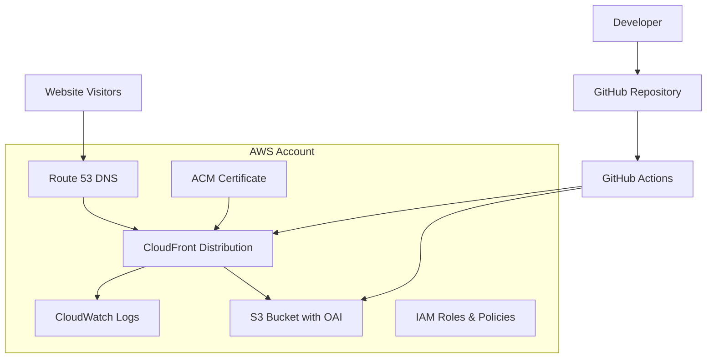

# Design Document: Static Website Infrastructure

## Overview

This design outlines a comprehensive static website infrastructure for zackspeakfitness.com using AWS services with Infrastructure as Code principles. The architecture follows AWS Well-Architected Framework pillars: security, reliability, performance efficiency, cost optimization, and operational excellence.

The system uses a modern static website hosting pattern with S3 for storage, CloudFront for global content delivery, ACM for SSL certificates, and GitHub Actions for automated CI/CD deployment. All infrastructure is defined using modular CloudFormation templates for reusability and learning purposes.

## Architecture

### High-Level Architecture



### Component Architecture

The infrastructure consists of several modular CloudFormation stacks:

1. **Certificate Stack**: ACM certificate with DNS validation
2. **Storage Stack**: S3 bucket with OAI configuration
3. **Distribution Stack**: CloudFront distribution with custom domain
4. **DNS Stack**: Route 53 hosted zone and record sets
5. **CI/CD Stack**: IAM roles and policies for GitHub Actions

## Components and Interfaces

### S3 Storage Component

**Purpose**: Secure static website file storage with Origin Access Control

**Configuration**:
- Bucket name: `zackspeakfitness-website-{random-suffix}`
- Region: us-west-2
- Storage class: Standard
- Public access: Blocked (access only via CloudFront OAC)
- Versioning: Enabled for rollback capability
- Server-side encryption: AES-256

**Security Features**:
- Origin Access Control (OAC) for CloudFront-only access
- Bucket policy restricting access to OAC principal
- No public read permissions
- HTTPS-only access policy

### CloudFront Distribution Component

**Purpose**: Global content delivery network with custom domain and SSL

**Configuration**:
- Origin: S3 bucket via OAC
- Custom domain: zackspeakfitness.com, www.zackspeakfitness.com
- SSL certificate: ACM certificate
- HTTP to HTTPS redirect: Enabled
- Compression: Enabled
- Price class: Use all edge locations

**Caching Behavior**:
- Default TTL: 86400 seconds (24 hours)
- Maximum TTL: 31536000 seconds (1 year)
- Compress objects automatically: Yes
- Viewer protocol policy: Redirect HTTP to HTTPS

**Security Headers**:
- Strict-Transport-Security: max-age=31536000; includeSubDomains
- X-Content-Type-Options: nosniff
- X-Frame-Options: DENY
- Referrer-Policy: strict-origin-when-cross-origin

### ACM Certificate Component

**Purpose**: SSL/TLS certificate for HTTPS encryption

**Configuration**:
- Domain names: zackspeakfitness.com, www.zackspeakfitness.com
- Validation method: DNS validation via Route 53
- Region: us-east-1 (required for CloudFront)
- Key algorithm: RSA-2048

### Route 53 DNS Component

**Purpose**: DNS management for custom domain

**Configuration**:
- Hosted zone: zackspeakfitness.com
- A record: zackspeakfitness.com → CloudFront distribution
- CNAME record: www.zackspeakfitness.com → CloudFront distribution
- Certificate validation records: Automatic via ACM

### GitHub Actions CI/CD Component

**Purpose**: Automated deployment and cache invalidation

**Workflow Triggers**:
- Push to main branch
- Manual workflow dispatch
- Pull request validation (optional)

**Deployment Steps**:
1. Checkout code
2. Configure AWS credentials (OIDC or secrets)
3. Validate HTML/CSS syntax
4. Sync files to S3 bucket
5. Invalidate CloudFront cache
6. Notify deployment status

**Security**:
- Least privilege IAM role for deployment
- OIDC provider for secure authentication
- No long-lived access keys

## Data Models

### CloudFormation Template Structure

```yaml
# Master template (nested stacks)
AWSTemplateFormatVersion: '2010-09-09'
Description: 'Static Website Infrastructure for zackspeakfitness.com'

Parameters:
  DomainName:
    Type: String
    Default: zackspeakfitness.com
  Environment:
    Type: String
    Default: prod
    AllowedValues: [dev, staging, prod]

Resources:
  CertificateStack:
    Type: AWS::CloudFormation::Stack
    Properties:
      TemplateURL: ./templates/certificate.yaml
      
  StorageStack:
    Type: AWS::CloudFormation::Stack
    Properties:
      TemplateURL: ./templates/storage.yaml
      
  DistributionStack:
    Type: AWS::CloudFormation::Stack
    Properties:
      TemplateURL: ./templates/distribution.yaml
      
  DNSStack:
    Type: AWS::CloudFormation::Stack
    Properties:
      TemplateURL: ./templates/dns.yaml
```

### Website Content Structure

```
website/
├── index.html              # Homepage
├── about.html             # About the trainer
├── services.html          # Training services
├── contact.html           # Contact and scheduling
├── testimonials.html      # Client testimonials
├── css/
│   ├── main.css          # Main stylesheet
│   └── responsive.css    # Mobile responsiveness
├── js/
│   ├── main.js           # Interactive features
│   └── analytics.js      # Google Analytics
├── images/
│   ├── hero-image.jpg    # Homepage hero image
│   ├── trainer-photo.jpg # Professional headshot
│   └── certifications/   # Certification images
└── assets/
    ├── favicon.ico       # Site favicon
    └── robots.txt        # SEO configuration
```

### GitHub Actions Workflow Configuration

```yaml
name: Deploy Static Website
on:
  push:
    branches: [main]
    paths: ['website/**']
  workflow_dispatch:

jobs:
  deploy:
    runs-on: ubuntu-latest
    permissions:
      id-token: write
      contents: read
    
    steps:
      - name: Checkout
        uses: actions/checkout@v4
        
      - name: Configure AWS credentials
        uses: aws-actions/configure-aws-credentials@v4
        with:
          role-to-assume: ${{ secrets.AWS_ROLE_ARN }}
          aws-region: us-west-2
          
      - name: Validate HTML
        run: |
          # HTML validation logic
          
      - name: Deploy to S3
        run: |
          aws s3 sync website/ s3://${{ secrets.S3_BUCKET_NAME }} --delete
          
      - name: Invalidate CloudFront
        run: |
          aws cloudfront create-invalidation --distribution-id ${{ secrets.CLOUDFRONT_DISTRIBUTION_ID }} --paths "/*"
```

## Correctness Properties

*A property is a characteristic or behavior that should hold true across all valid executions of a system-essentially, a formal statement about what the system should do. Properties serve as the bridge between human-readable specifications and machine-verifiable correctness guarantees.*

Since this infrastructure project involves configuration and deployment rather than algorithmic logic, the correctness properties focus on infrastructure validation, security verification, and deployment consistency. These properties will be implemented as integration tests and infrastructure validation scripts.

### Property 1: HTTPS Redirect Consistency
*For any* HTTP request to the domain, the system should consistently redirect to the HTTPS equivalent with proper status codes
**Validates: Requirements 2.3, 2.5**

### Property 2: OAC Security Enforcement
*For any* attempt to access S3 bucket content, direct access should be denied while CloudFront access should succeed
**Validates: Requirements 1.2, 5.1**

### Property 3: Certificate Domain Coverage
*For any* subdomain in the certificate (zackspeakfitness.com, www.zackspeakfitness.com), HTTPS connections should use the ACM certificate
**Validates: Requirements 2.2, 2.4**

### Property 4: CloudFormation Template Completeness
*For any* deployment of the CloudFormation stack, all required AWS resources (S3, CloudFront, ACM, Route 53) should be created successfully
**Validates: Requirements 3.1, 3.5**

### Property 5: Security Headers Consistency
*For any* HTTP response from CloudFront, security headers (HSTS, X-Content-Type-Options, X-Frame-Options) should be present
**Validates: Requirements 5.2**

### Property 6: Deployment Automation Reliability
*For any* code push to main branch affecting website files, the GitHub Actions pipeline should deploy changes and invalidate cache
**Validates: Requirements 4.1, 4.2**

### Property 7: Content Accessibility
*For any* static file in the website directory, it should be accessible via HTTPS through the CloudFront distribution
**Validates: Requirements 1.1, 1.3**

### Property 8: DNS Resolution Consistency
*For any* DNS query for zackspeakfitness.com or www.zackspeakfitness.com, it should resolve to the CloudFront distribution
**Validates: Requirements 2.1**

## Error Handling

### Infrastructure Deployment Errors

**CloudFormation Stack Failures**:
- Rollback on resource creation failure
- Detailed error logging in CloudWatch
- Parameter validation before deployment
- Dependency ordering to prevent circular references

**Certificate Provisioning Errors**:
- DNS validation timeout handling
- Automatic retry for certificate requests
- Clear error messages for domain ownership issues
- Fallback to manual validation if DNS validation fails

**S3 Bucket Creation Errors**:
- Unique bucket naming with random suffixes
- Region-specific error handling
- Proper cleanup on partial deployment failures
- Bucket policy validation before application

### CI/CD Pipeline Errors

**GitHub Actions Failures**:
- Fail fast on credential configuration errors
- Retry logic for transient AWS API errors
- Rollback capability for failed deployments
- Clear error notifications with actionable messages

**File Validation Errors**:
- HTML/CSS syntax validation before deployment
- Image optimization and size validation
- Broken link detection in static content
- SEO metadata validation

**Deployment Synchronization Errors**:
- Atomic deployment operations where possible
- Verification of file upload completion
- CloudFront invalidation error handling
- Deployment status verification

### Runtime Errors

**CloudFront Distribution Errors**:
- Custom error pages for 4xx/5xx responses
- Origin failover configuration (if multiple origins)
- Cache invalidation error handling
- Geographic restriction error handling

**DNS Resolution Errors**:
- Health checks for DNS propagation
- TTL configuration for quick recovery
- Monitoring for DNS resolution failures
- Backup DNS provider consideration

## Testing Strategy

### Infrastructure Validation Testing

**CloudFormation Template Testing**:
- Use `cfn-lint` for template syntax validation
- Use `cfn-nag` for security best practices validation
- Template unit tests using `taskcat` for multi-region deployment
- Parameter validation testing with edge cases

**AWS Resource Configuration Testing**:
- Verify S3 bucket policies and OAC configuration
- Test CloudFront distribution settings and behaviors
- Validate ACM certificate configuration and DNS validation
- Check Route 53 DNS record configuration

### Integration Testing

**End-to-End Deployment Testing**:
- Deploy complete stack in test environment
- Verify all components work together correctly
- Test HTTPS connectivity and certificate validation
- Validate DNS resolution and routing

**Security Testing**:
- Penetration testing for direct S3 access attempts
- SSL/TLS configuration testing using tools like `ssllabs`
- Security header validation using automated tools
- Access control testing for GitHub Actions permissions

### Automated Testing in CI/CD

**Pre-deployment Validation**:
- HTML/CSS syntax validation using `html5validator`
- Link checking using tools like `linkchecker`
- Image optimization validation
- Performance testing with Lighthouse CI

**Post-deployment Verification**:
- Health check endpoints to verify deployment success
- Cache invalidation verification
- Performance regression testing
- Security header verification

### Property-Based Testing Configuration

**Testing Framework**: Use Python with `pytest` and `boto3` for AWS integration testing
**Test Configuration**: Minimum 100 iterations per property test where applicable
**Test Environment**: Separate AWS account or isolated environment for testing
**Test Data**: Generate test cases for different domain configurations, file types, and deployment scenarios

**Example Property Test Structure**:
```python
# Feature: static-website-infrastructure, Property 1: HTTPS Redirect Consistency
def test_https_redirect_consistency():
    """Test that all HTTP requests redirect to HTTPS"""
    # Test implementation
```

### Manual Testing Checklist

**Pre-deployment Manual Verification**:
- [ ] CloudFormation template syntax validation
- [ ] Parameter file configuration review
- [ ] GitHub Actions workflow configuration review
- [ ] DNS configuration verification

**Post-deployment Manual Verification**:
- [ ] Website accessibility via HTTPS
- [ ] Certificate validation in browser
- [ ] Mobile responsiveness testing
- [ ] Performance testing from different geographic locations
- [ ] SEO metadata verification

### Monitoring and Alerting

**CloudWatch Metrics**:
- CloudFront request count and error rates
- S3 bucket access patterns
- Certificate expiration monitoring
- GitHub Actions workflow success rates

**Alerting Configuration**:
- Certificate expiration alerts (30 days before expiry)
- High error rate alerts from CloudFront
- Failed deployment notifications
- Unusual traffic pattern alerts

This comprehensive testing strategy ensures the infrastructure is reliable, secure, and performs well while providing clear feedback for any issues that arise during deployment or operation.